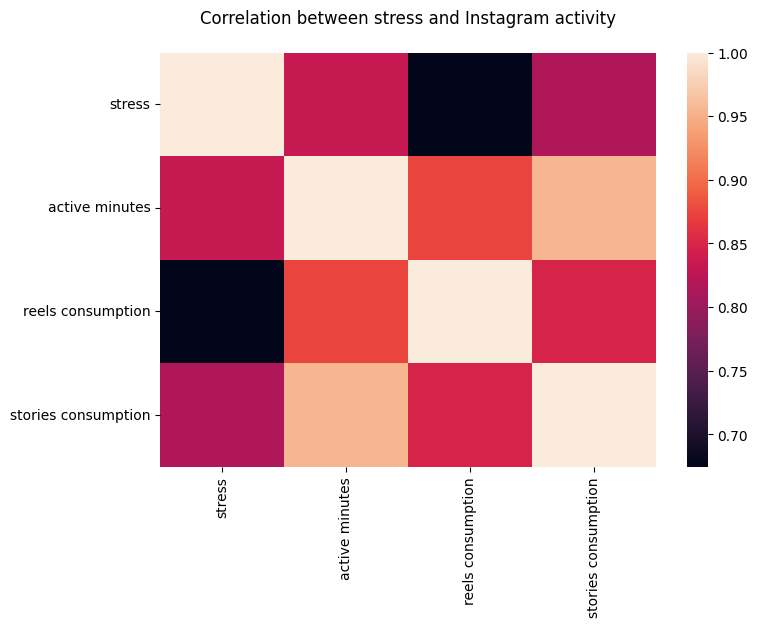
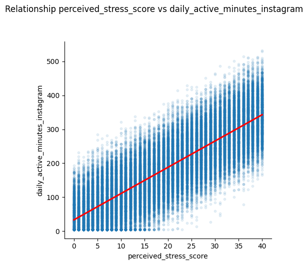
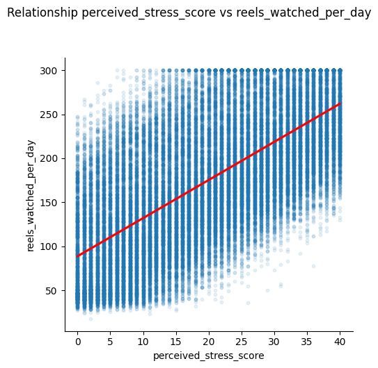
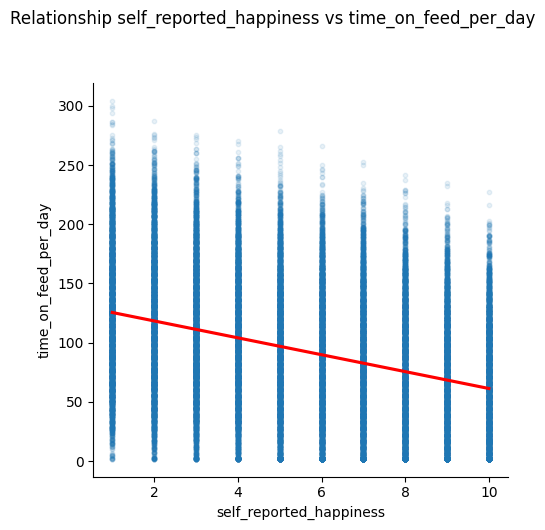
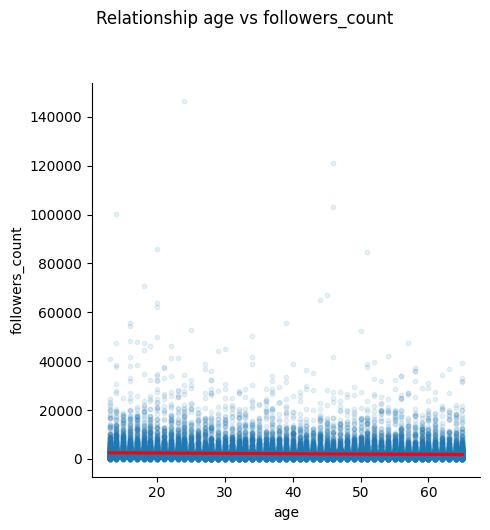
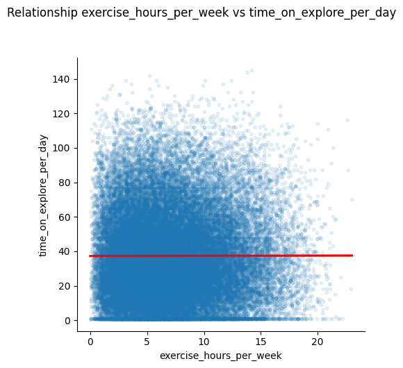
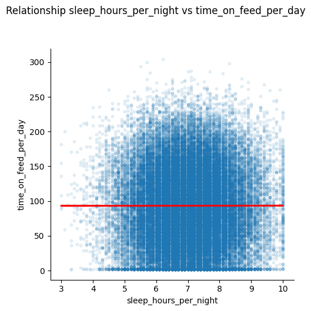

# Social Media User Analysis

This project provides analysis for 1,000,000+ fully synthetic user profiles. The goal is to investigate how lifestyle factors (stress, exercise, sleep) correlate with social media consumption patterns (Reels, Feed, Stories).

## Keys

* Higher perceived stress → increased daily active minutes & more reels/stories consumption
* Lower self-reported happiness → longer sessions & higher feed/reels time
* Younger age → significantly higher reels watched, posts created, follower growth
* More exercise & better sleep → slightly higher happiness & lower compulsive usage

## Results

On the graphic, we can see that stress has a strong influence on the daily active minutes and reels/stories consumption. More stress — more active minutes and Instagram consumption.



On the scatter plot, we can see the strong relation between stress and instagram using.






Correlation between happiness and reels/feed time negative and equal approximiet -0.2. So unhappy people spend more time on Instagram and vice versa.





Age influences on posts created count negative and don't influence on followers count.




Healthy lifestyle (more exercises/better sleep) doesn't influence on happiness and Instagram usage because correlation almost 0 (0.001...).








## How to Run

Clone the repository:
```bash
    git clone https://github.com/Nikita-Titarenko/instagram-analysis.git
```

Install dependencies:
```bash
    pip install pandas seaborn matplotlib kagglehub
```

Run
```bash
    python main.py
```